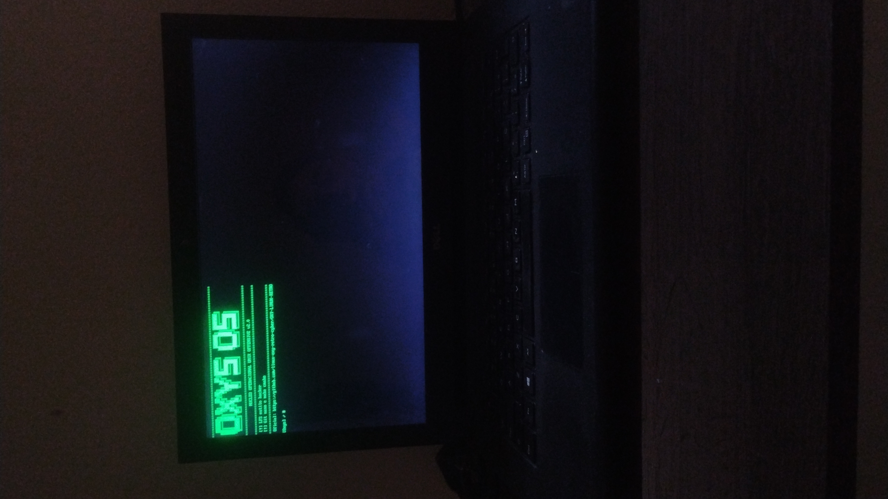
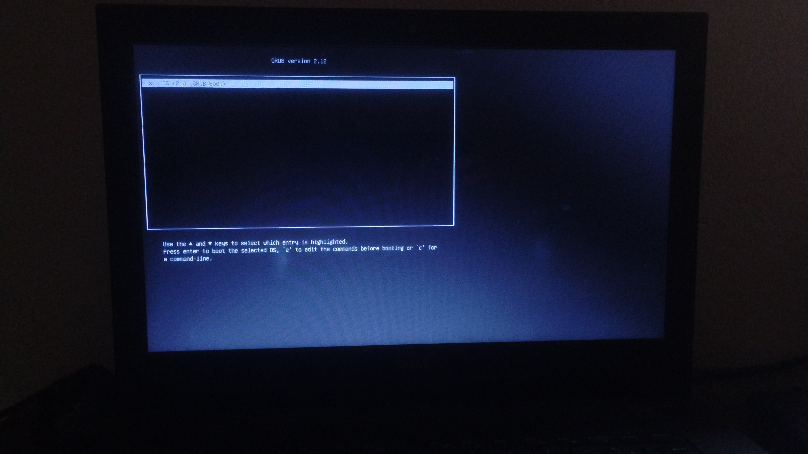
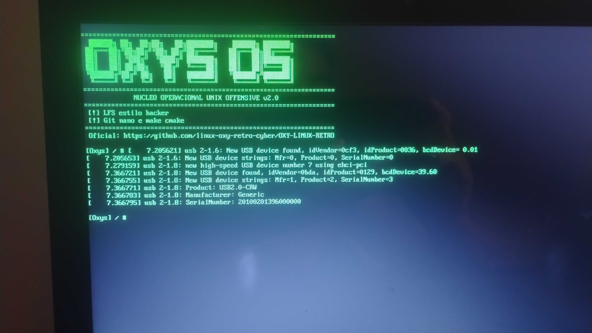

# Oxy-os-wiki
A wiki os Oxy os

Essa e uma versão teórica mas contem coisas testadas se estiver teorica e pq e teorica

algumas coisas nao foram testada possui teoria mas sobe o estudo do sistema 

---

## POR QUE E TEORICO?
Isso de da por que nao foi testada por falta de hardware 

---

## Consumo de ram e cpu
Ao ser testado em hardware real ele consumi 1gb de ram e wntorno de 0 a 2 por cento da cpu
**OBS** foi testado em um dell Inspiron 14 3442
com 8gb de ram uma cpu i3 4005u e uma gpu integrada hd grafics 4400

---

## Comandos basicos

 Comandos Básicos do BusyBox (Manipulação de Arquivos)

| Comando | Descrição | Exemplo de Uso |
| :--- | :--- | :--- |
| **`ls`** | Lista os arquivos e diretórios do diretório atual. | `ls -la` |
| **`cd`** | Altera o diretório de trabalho atual. | `cd /mnt/system` |
| **`pwd`** | Exibe o caminho completo do diretório atual. | `pwd` |
| **`cp`** | Copia arquivos ou diretórios. | `cp arquivo.txt /backup/` |
| **`mv`** | Move ou renomeia arquivos e diretórios. | `mv antigo.txt novo.txt` |
| **`rm`** | Remove (deleta) arquivos ou diretórios. | `rm -rf diretorio_velho` |
| **`mkdir`** | Cria um novo diretório. | `mkdir novo_diretorio` |
| **`touch`** | Cria um arquivo vazio ou atualiza a data de modificação. | `touch script.sh` |
| **`cat`** | Exibe o conteúdo de um arquivo no terminal. | `cat /proc/version` |
| **`chmod`** | Altera as permissões de acesso de arquivos/diretórios. | `chmod +x script.sh` |
| **`chown`** | Altera o dono e o grupo de arquivos/diretórios. | `chown root:root arquivo` |
| **`find`** | Procura por arquivos na árvore de diretórios. | `find . -name "*.conf"` |
| **`grep`** | Procura por padrões de texto dentro de arquivos. | `grep "erro" log.txt` |
| **`df`** | Exibe o uso de espaço em disco dos sistemas de arquivos. | `df -h` |
| **`du`** | Exibe o espaço em disco utilizado por arquivos/diretórios. | `du -sh *` |

---

## 💾 Natureza do Sistema: Imutabilidade em RAM

Por carregar o seu rootfs (sistema de arquivos raiz) diretamente na memória RAM através de um ramfs/initramfs, o Oxy OS é essencialmente imutável enquanto está rodando no modo Live.
---
## ⚠️ Aviso de Persistência:

No modo padrão, qualquer arquivo criado, código compilado ou configuração alterada nas pastas do sistema (/bin, /etc, /usr) sumirá completamente assim que o computador for desligado ou reiniciado. A RAM perde a energia, e o sistema volta ao estado original no próximo boot.

--

## 🛠️ Ferramentas de Compilação e Status
A versão 2.0 vem equipada com umatoolchain completa para desenvolvimento nativo:

gcc / g++: Compiladores nativos para C e C++. Permitem escrever códigos usando o nano e compilá-los diretamente de dentro do Oxy OS.
make / cmake: Utilitários de automação de build. Essenciais para gerenciar e compilar projetos complexos sem depender de um sistema hospedeiro.
fastfetch: A versão moderna e ultra-rápida do Neofetch (escrita em C). Renderiza a logo customizada em ASCII do Oxy OS, o uptime e o consumo real de memória.
---
## ⚠️ Zona de Perigo: Comandos Proibidos / Sensíveis
Embora o sistema seja executado na memória, certos comandos podem travar a sessão ou danificar storages físicos conectados:
rm -rf /: Destrói o sistema de arquivos montado na RAM. O funcionamento do OS é corrompido imediatamente, gerando travamentos ou congelamento do terminal, exigindo reinício manual.
dd if=/dev/zero of=/dev/sdX ou mkfs.ext2 /dev/sdX: CUIDADO ABSOLUTO. Executar esses comandos apontando para um HD ou pendrive real (sda, sdb, etc.) vai apagar todos os dados físicos de forma irreversível.
kill -9 1: Tentar finalizar o PID 1 (o script /init ou o processo do BusyBox) causará um 

---

Kernel Panic instantâneo, derrubando a máquina.
## 💿 Métodos de Instalação e Arquitetura
1. Instalação Teórica /teorico (O Método Chroot + Alias)
Este método consiste em extrair a estrutura de desenvolvimento do Oxy OS moderno para uma partição dedicada do HD e acessá-la de forma isolada.
Como funciona: O usuário dá boot no Oxy OS leve (rodando totalmente na RAM). A partir desse ambiente, ele pega todo o conteúdo estruturado que está na memória e copia/extrai para uma partição secundária do HD (formatada em ext2 via fdisk).
O Acesso via Chroot: O sistema base continua rodando na RAM, mas o usuário configura um alias no terminal para automatizar o processo de montar essa partição do HD e entrar nela via chroot. Dessa forma, o GCC, Git e CMake rodam dentro do ambiente isolado do HD, permitindo salvar projetos e códigos permanentemente no disco físico sem estourar o espaço da RAM.

## 3. Instalação Inviável (O Método ISO Direta no HD)
Este é o método onde o arquivo de imagem do sistema é colocado diretamente no disco rígido de forma bruta.
Como funciona: Em vez de extrair as pastas e arquivos do sistema para o HD, o usuário simplesmente move o arquivo .iso / .img fechado para dentro do HD e configura o gerenciador de boot (GRUB) para ler esse arquivo diretamente do disco.
Por que é considerado inviável a longo prazo? Toda vez que o computador iniciar, o GRUB vai ler a ISO do HD e carregar ela inteira na memória RAM novamente. O sistema continua operando como um ramfs temporário: você ganha a velocidade absurda da RAM, mas mantém o fator da imutabilidade. Nenhuma alteração feita nas pastas do sistema será salva no HD ao desligar, agindo exatamente como um Live-USB eterno, só que direto do disco rígido.

---

📸 Print Rodando no Sistema
Esta seção mostra o Oxy OS v2.0 em execução direta no hardware, exibindo o tempo de atividade e o consumo de recursos na interface de linha de comando.

tela do grub

 tela de boas vindas do oxy os
mostrando a logo etc

 fastfetch 

estrutura de pasta e comando ls

